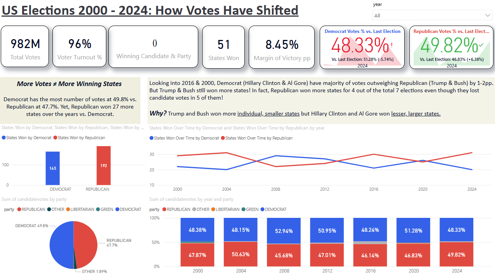
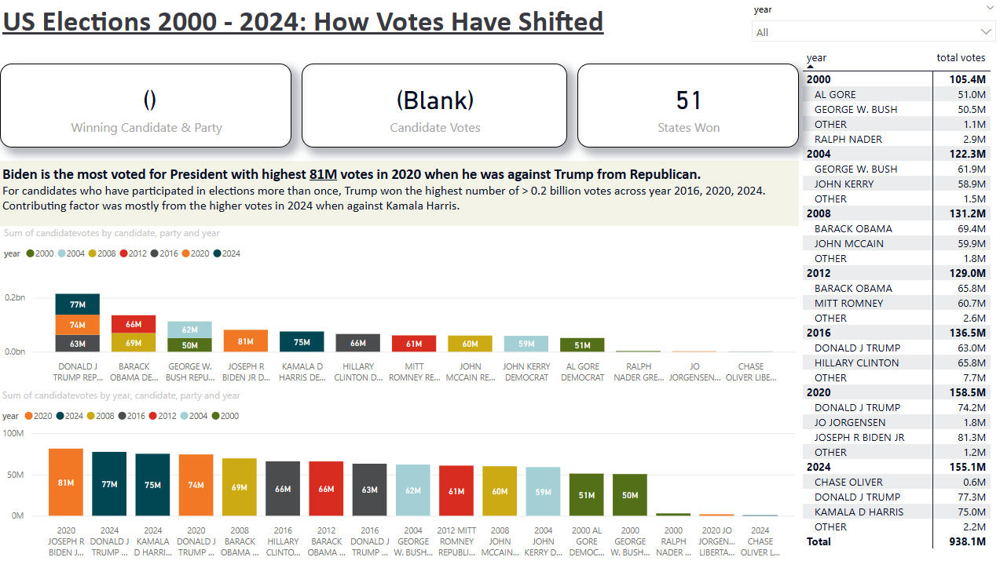
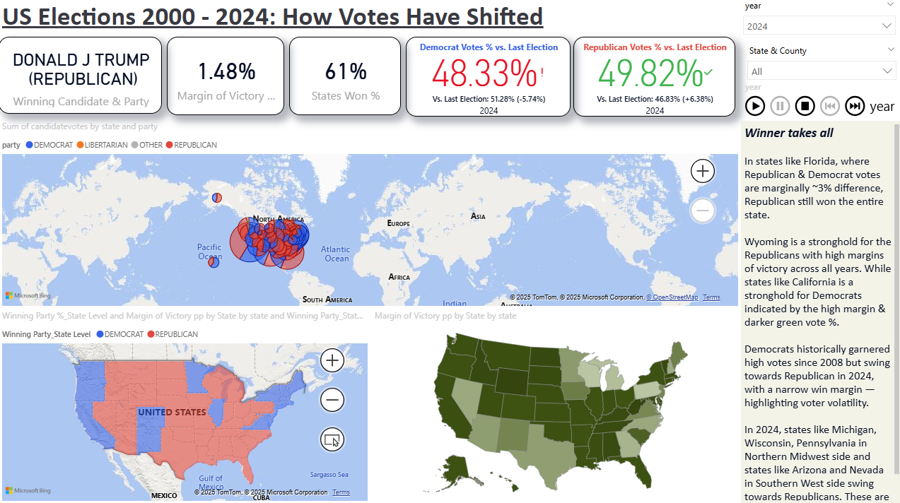
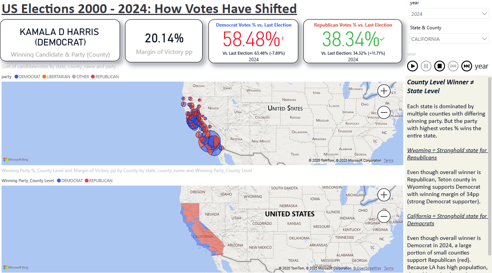
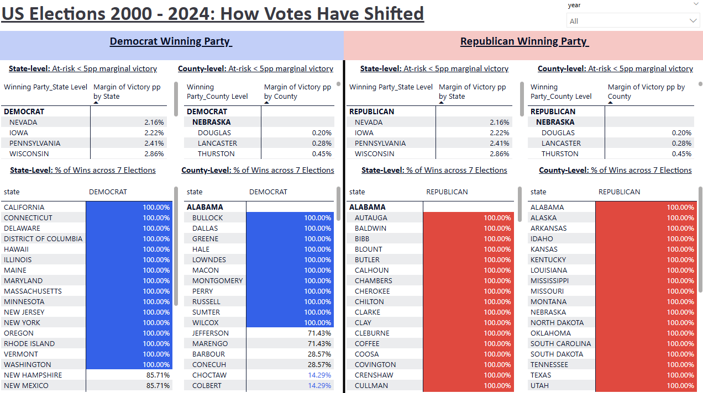

# Power BI Project: U.S. Presidential Elections 
This project aims to explore insights and tell a story from an interactive Power BI dashboard through analyzing the U.S. Presidential elections so far in the 21st century from year 2000 to 2024. Source of data is from official state election data records.

This repository contains all documents of the project, including:
- [Power BI Dashboard](US_election_power_bi_dashboard.pbix) for visualisation
- [Dataset](countypres_2000-2024.xlsx)

## 📊 Power BI Dashboard
The dashboard is divided into 4 levels: National level, State level, County level and Swing States.

1) **National Level:** Features the overall states won and candidate votes of both Democrat and Republican parties overtime, as well as individual candidate votes.
 

2) **State Level:** Features proportion of candidate votes between Democrat and Republican for every state, and winning party as well as margin of victory for every state.  

3) **County Level:** Features winning party and proportion of candidate votes between Democrat and Republican for every state

4) **Swing States:** Features states and county that are at risk of swinging to another party (i.e. < 5pp marginal victory) and their % of wins across 7 elections

## Demo Video 
Watch a short demo of the dashboard in action: https://www.loom.com/share/3ca9b7f826d541b78bba05144d31e175

## Download the Dashboard
Want to explore the dashboard interactively? 
[Download the `.pbix` file](US_election_power_bi_dashboard.pbix)